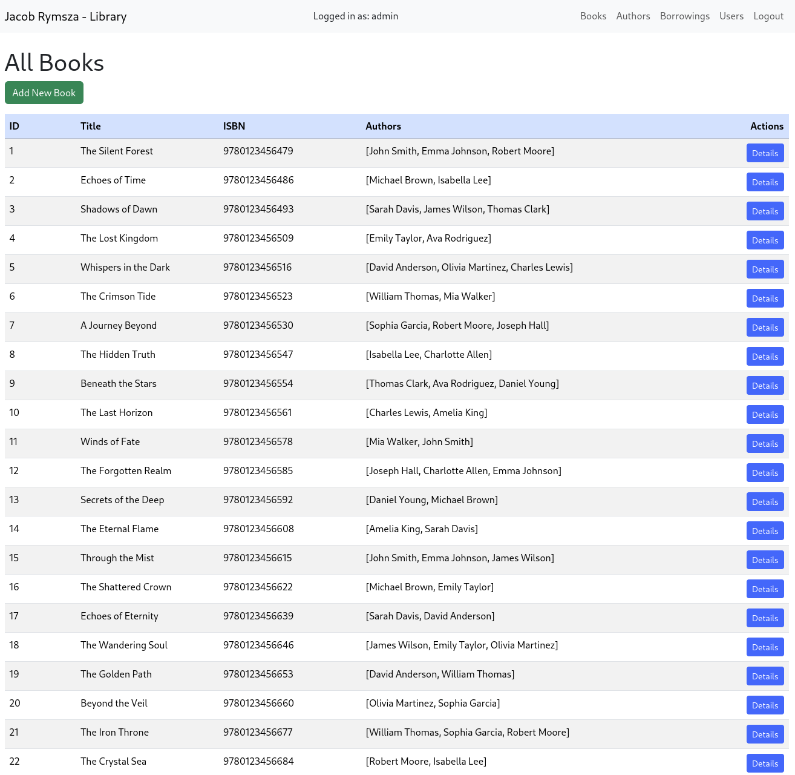
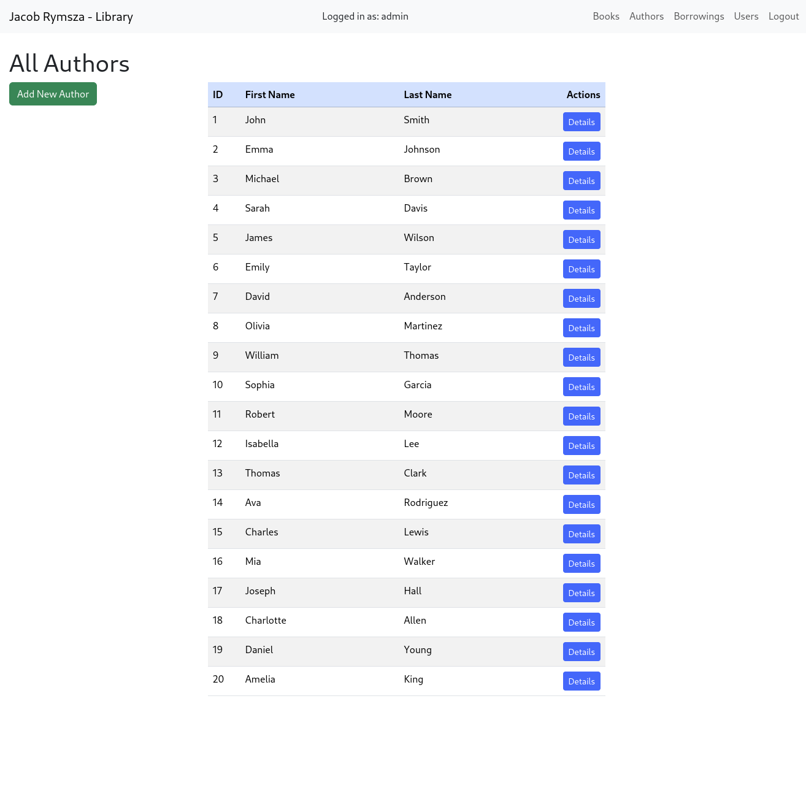
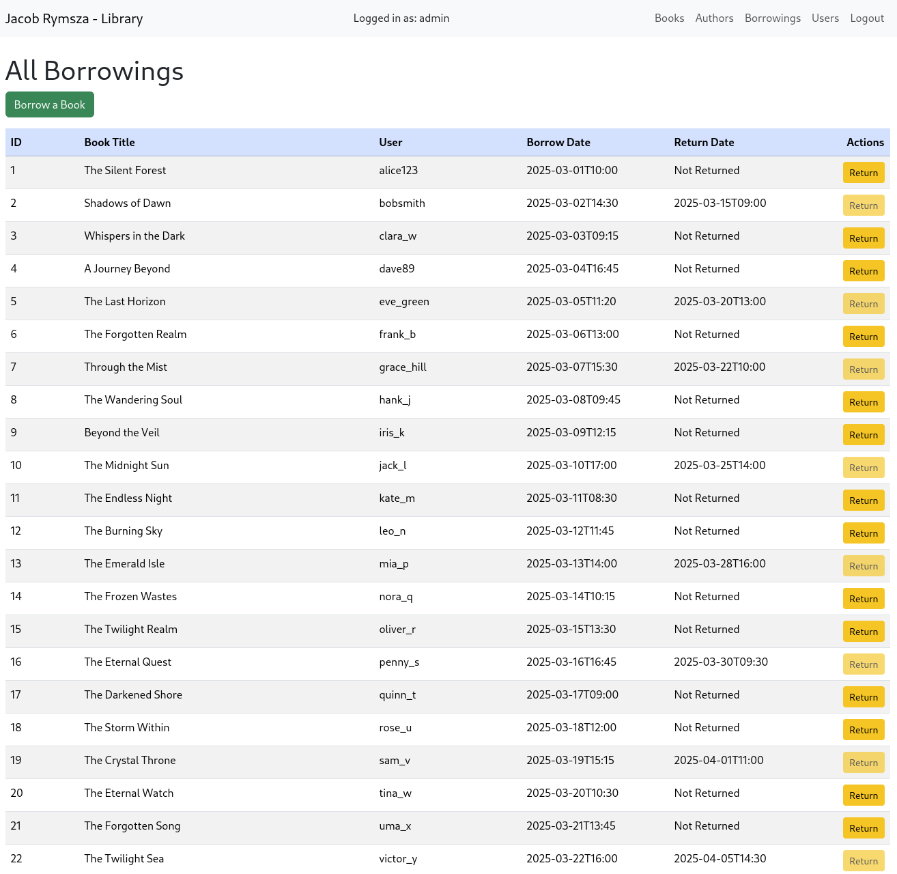
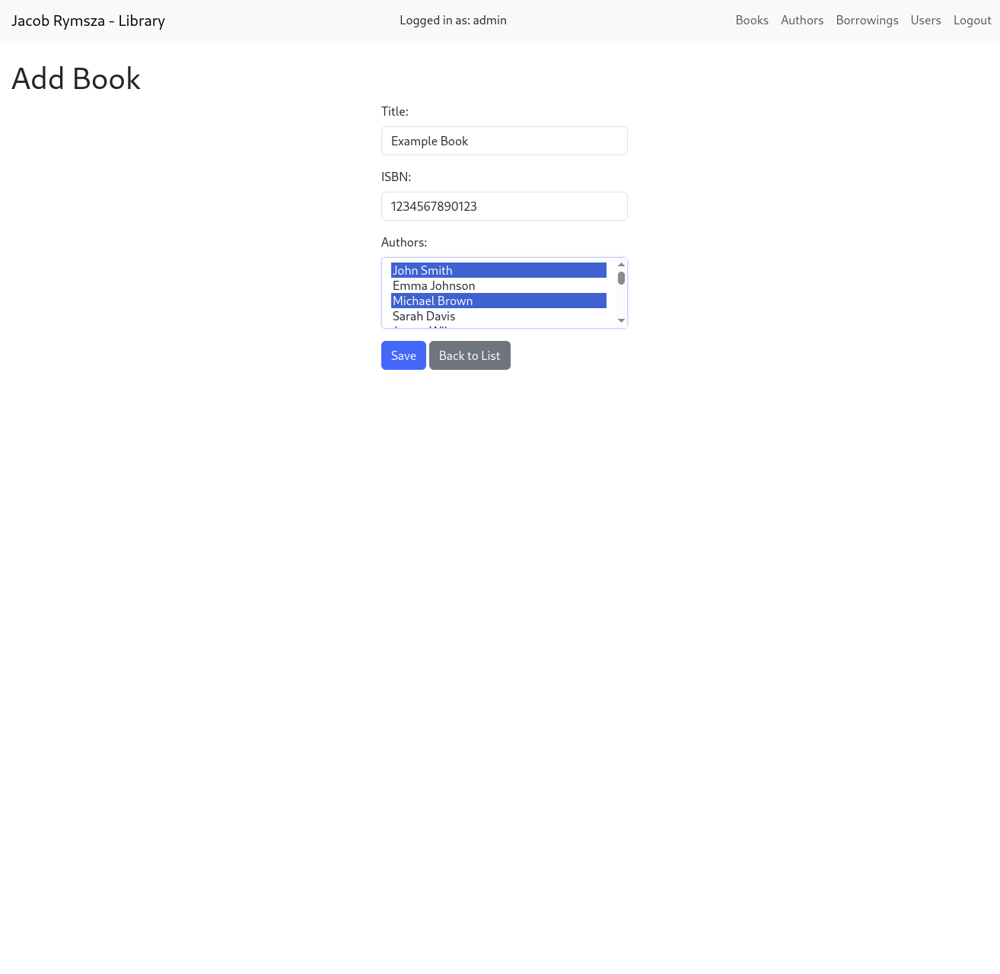
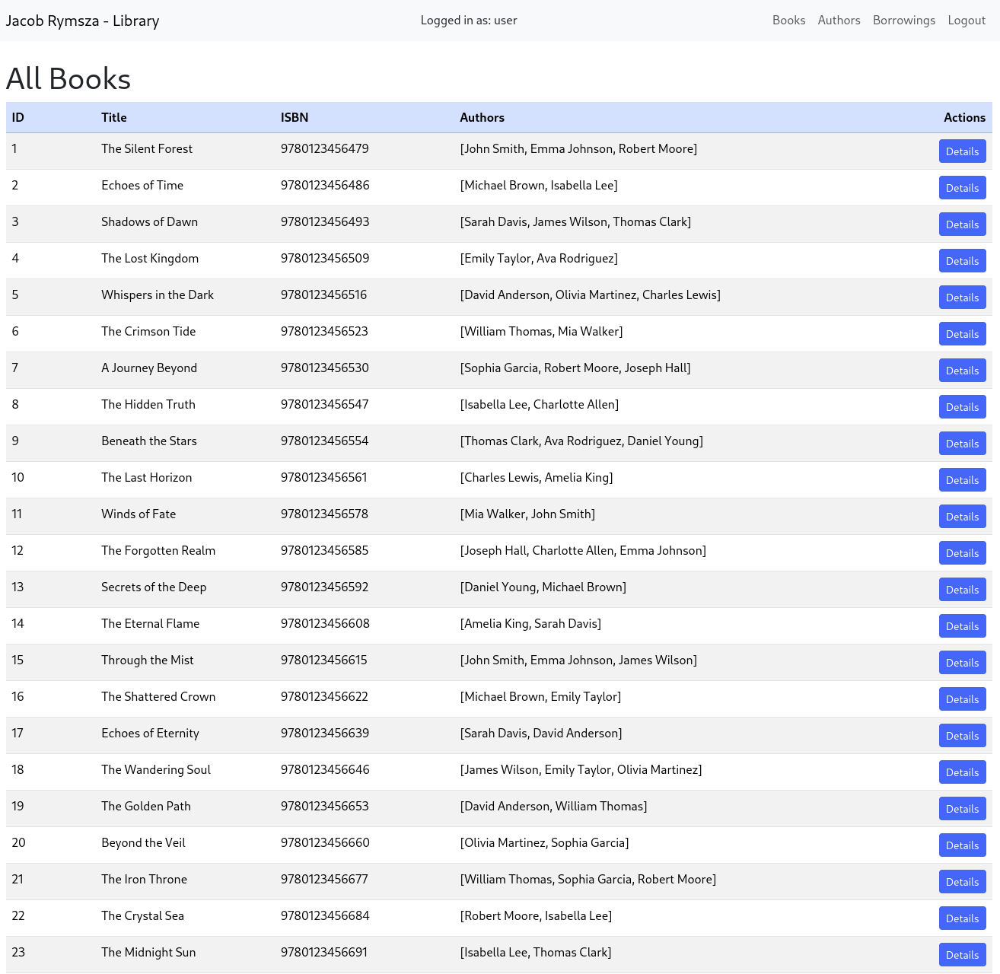
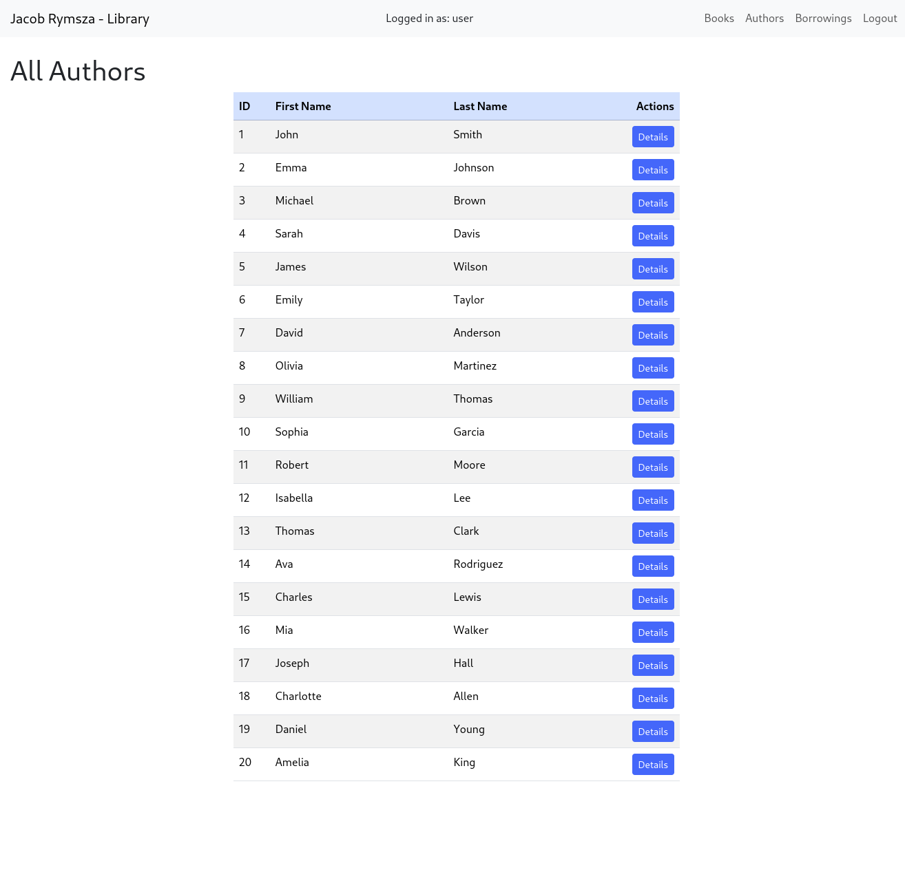
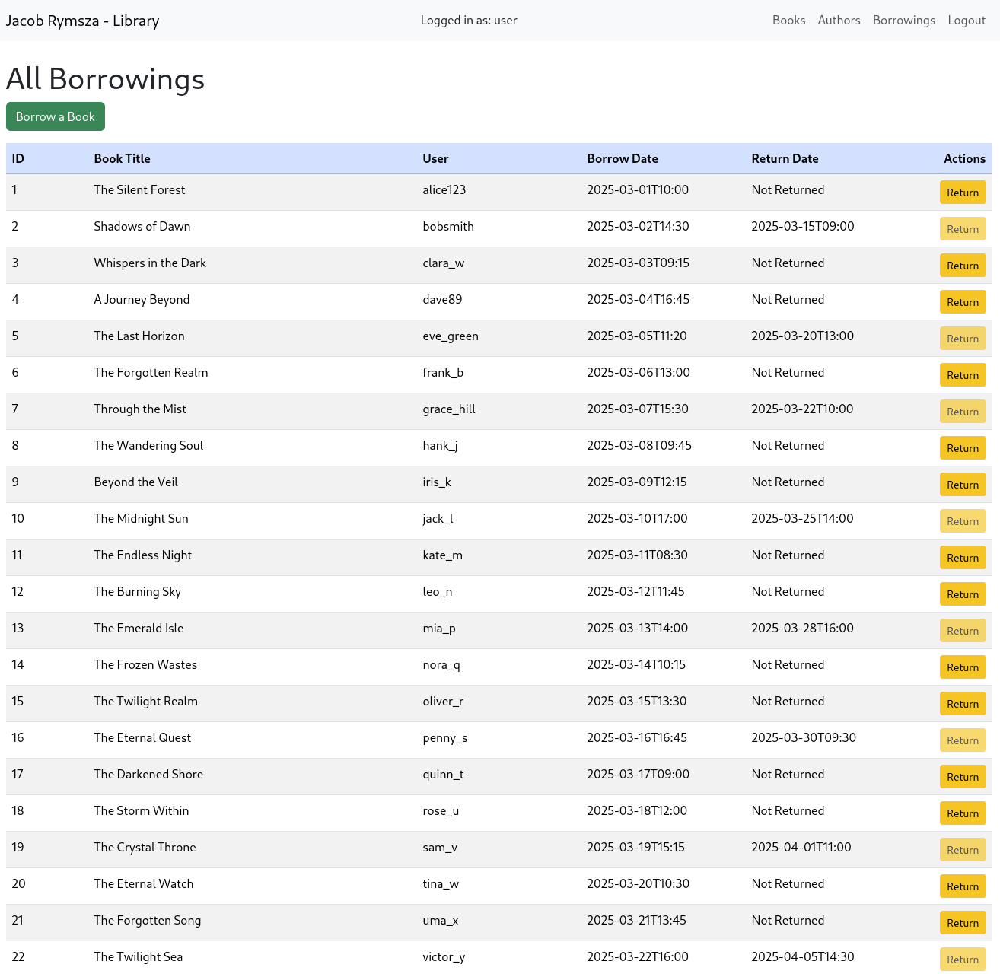
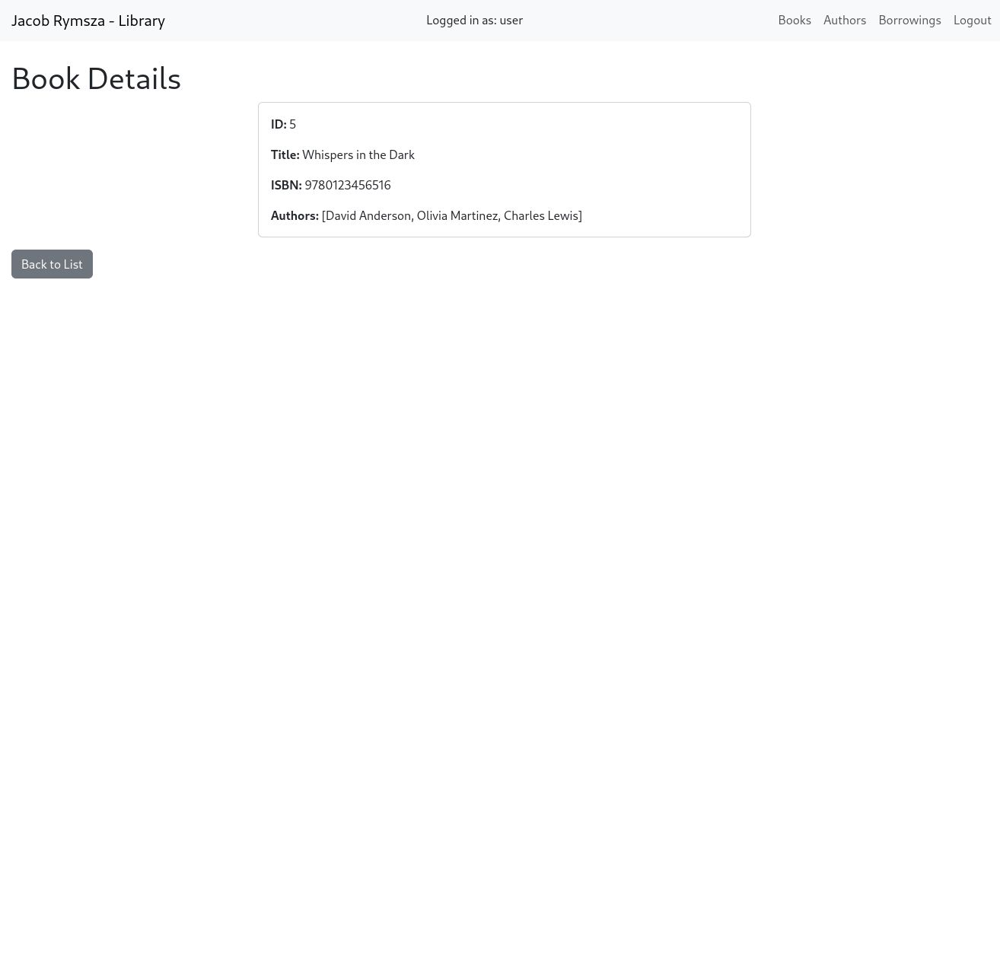
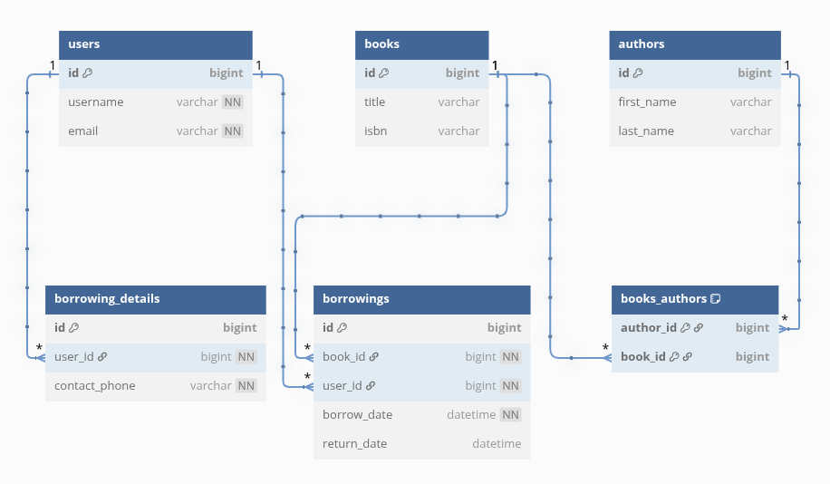

# Library Management System

## Description
The Library Management System is a robust, web-based application designed to streamline the management of library resources, including books, authors, users, and borrowing records. Built with **Spring Boot** and **Thymeleaf**, it provides both a user-friendly web interface and a RESTful API for programmatic access, making it versatile for librarians, administrators, and developers alike. The system integrates with a **MySQL** database via **Spring Data JPA** and leverages **Spring Security** for role-based access control, distinguishing between USER and ADMIN roles to ensure secure and appropriate access to features.

Key functionalities include adding and managing books with their ISBNs and author associations, tracking borrowing history with dates, and managing user accounts. The web interface, styled with **Bootstrap 5.3.2**, offers an intuitive experience for browsing, borrowing, and returning books, while administrators can perform advanced operations like creating new books, authors, and users. The REST API enables seamless integration with external systems, supporting operations such as retrieving book details, creating borrowings, and more.

The application is containerized with **Docker** and **Docker Compose** for easy deployment and scalability. It includes comprehensive error handling, logging via **SLF4J** with **AOP**, and unit tests using **JUnit 5** and **Mockito** to ensure reliability. This project is ideal for small to medium-sized libraries looking for an efficient, modern solution to manage their collections and user interactions.

### Administrator
[](assets/admin-books.png) [](assets/admin-authors.png) [](assets/admin-borrowings.png) [](assets/admin-add-book.png)


### User
[](assets/user-books.png) [](assets/user-authors.png) [](assets/user-borrowings.png) [](assets/user-book-details.png)

## Features

- **Book Management**
    - Add new books with titles, ISBNs, and multiple authors via a web form or REST API (`POST /api/books`).
    - View detailed book information, including ID, title, ISBN, and associated authors (`GET /api/books/{id}`).
    - Update or delete existing books (Admin only, `PUT /api/books/{id}`, `DELETE /api/books/{id}`).
    - List all books with a clean, responsive table interface (`/books`).


- **Author Management**
    - Create new authors with first and last names (Admin only, `POST /api/authors`).
    - View author details, including their associated books (`GET /api/authors/{id}`).
    - Update or delete authors (Admin only, `PUT /api/authors/{id}`, `DELETE /api/authors/{id}`).
    - Browse all authors in a tabulated format (`/authors`).


- **User Management**
    - Register new users with usernames and emails (Admin only, `/users/new`).
    - Display user details like ID, username, and email (`/users/{id}`).
    - List all users in a secure, admin-only view (`/users`).


- **Borrowing Tracking**
    - Borrow a book by selecting a book and user, with automatic borrow date assignment (`/borrowings/new`, `POST /api/borrowings`).
    - Return a borrowed book, updating the return date (`/borrowings/{id}/return`, `PUT /api/borrowings/{id}/return`).
    - View borrowing history with book titles, usernames, borrow dates, and return status (`/borrowings`).
    - Ensure books can only be borrowed if available (checked via `BorrowingService.isBookAvailable`).


- **Role-Based Security**
    - Two roles: **USER** (view and borrow books) and **ADMIN** (full access to manage books, authors, and users).
    - Secured with **Spring Security**, featuring a custom login page (`/login`) and logout functionality.
    - Admin-only actions protected with `@PreAuthorize("hasRole('ADMIN')")`.


- **RESTful API**
    - Comprehensive API for books, authors, and borrowings (`/api/books`, `/api/authors`, `/api/borrowings`).
    - Supports CRUD operations with JSON responses and proper HTTP status codes (e.g., 201 Created, 400 Bad Request).
    - Error handling for invalid requests via `RestGlobalExceptionHandler`.


- **Responsive Web Interface**
    - Built with **Thymeleaf** templates and styled with **Bootstrap 5.3.2** for a modern, mobile-friendly UI.
    - Includes navigation bar, forms with client-side validation, and error pages (`/error`).


- **Database Integration**
    - Persistent storage with **MySQL**, managed via **Spring Data JPA**.
    - Entities include `Book`, `Author`, `User`, `Borrowing`, and `BorrowingDetails` with proper relationships (e.g., many-to-many for books and authors).


- **Logging and Monitoring**
    - Method-level logging with **SLF4J** and **AOP** (`LoggingAspect`) for controllers and services.
    - Tracks method entry, exit, and exceptions for debugging and auditing.


- **Testing**
    - Unit tests for controllers (`AuthorControllerTest`, `BookControllerTest`, `BorrowingControllerTest`) and services (`BookServiceTest`, `BorrowingServiceTest`, `AuthorServiceTest`).
    - Uses **JUnit 5** and **Mockito** for mocking dependencies and verifying behavior.


- **Containerization**
    - Deployable with **Docker** and **Docker Compose** for consistent environments (`docker-compose.yml`).
    - Includes MySQL container setup with predefined credentials.

## Technologies Used

- **Backend**
    - **Java 17**: The core programming language, providing modern features like records and enhanced performance for the application.
    - **Spring Boot 3.x**: A framework for building the application, simplifying configuration, dependency management, and deployment with an embedded Tomcat server.
    - **Spring Security**: Implements role-based authentication and authorization (USER and ADMIN roles), securing endpoints and pages with a custom login form.
    - **Spring Data JPA**: Handles database interactions with Hibernate as the ORM, mapping entities like `Book`, `Author`, and `Borrowing` to MySQL tables.
    - **Maven**: The build tool for managing dependencies (e.g., `spring-boot-starter-web`, `mysql-connector-java`) and building the project (`pom.xml`).


- **Frontend**
    - **Thymeleaf**: A server-side templating engine integrated with Spring Boot, rendering dynamic HTML pages (e.g., `books/list.html`, `authors/new.html`) with data binding.
    - **Bootstrap 5.3.2**: A CSS framework (via Webjars) for responsive, mobile-friendly styling of the web interface, including tables, forms, and navigation bars.
    - **HTML5/CSS/JavaScript**: Core web technologies for structuring pages, custom styling (`styles.css`), and client-side validation (e.g., in `users/new.html`).


- **Database**
    - **MySQL**: A relational database for persistent storage, configured via `docker-compose.yml` and `application.properties`, storing tables like `books`, `authors`, and `borrowings`.

        #### Entity-Relationship Diagram:
        [](assets/database-erd.png)

- **Containerization**
    - **Docker**: Containerizes the application and MySQL database, ensuring consistent environments across development and production (`Dockerfile`).
    - **Docker Compose**: Orchestrates multi-container setup (app and MySQL) with predefined configurations for ports, volumes, and environment variables (`docker-compose.yml`).


- **Testing**
    - **JUnit 5**: The testing framework for writing unit tests, integrated with Spring Boot Test for application context loading.
    - **Mockito**: A mocking library used in tests (e.g., `AuthorControllerTest`, `BookServiceTest`) to simulate dependencies like repositories and services.


- **Logging**
    - **SLF4J with Logback**: Provides a logging facade and implementation, used in `LoggingAspect` for method-level logging of controllers and services.
    - **AspectJ (AOP)**: Enables aspect-oriented programming to log method entry, exit, and exceptions across the application (`LoggingAspect.java`).


- **Dependencies and Tools**
    - **Webjars**: Manages client-side dependencies like Bootstrap (`webjars/bootstrap/5.3.2`), simplifying integration with Maven.
    - **Jakarta Validation**: Adds validation annotations (e.g., `@NotBlank`, `@Pattern`) to DTOs like `BookDTO` and `AuthorDTO` for input validation.

## Prerequisites

Before running or developing the Library Management System, ensure the following tools and configurations are in place:

- **Java 17 or Higher**
    - The application is built with Java 17, leveraging its modern features. Install a compatible JDK (e.g., OpenJDK or Oracle JDK).
    - Verify installation: `java -version` should show `17.x.x` or later.
    - Required for: Compiling and running the Spring Boot application (`LibraryManagementSystemApplication.java`).


- **Maven 3.8.x or Higher**
    - Used as the build tool to manage dependencies and execute the project (`pom.xml`).
    - Install Maven and confirm with: `mvn -version`.
    - Required for: Building the project (`mvn clean install`) and running it locally (`mvn spring-boot:run`).


- **Docker**
    - Needed for running the app and MySQL via Docker Compose (`docker-compose.yml`).
    - Install Docker Desktop (Windows/Mac) or Docker Engine (Linux), and verify with: `docker --version`.
    - Docker Compose should also be installed (typically bundled with Docker Desktop; check with `docker compose version`).
    - Required for: Simplified setup with `docker compose up --build`.


- **Environment Configuration**
    - The application relies on environment variables for database connections, security credentials, and optional test execution.
        - **Docker Setup**: Create a `.env` file in the project root based on the example below and customize the values. Docker Compose uses this file to configure the app and MySQL containers.
    - **Example `.env` File** (copy as `.env` and edit):
        - **Key Variables**:
          - `TZ`: Sets the timezone for Docker containers (e.g., `Europe/Warsaw`).
          - `MYSQL_*`: Configures MySQL database access (root password, database name, user credentials).
          - `RUN_TESTS`: Boolean to enable/disable test execution during startup (set to `true` or `false`).
          - `USER_*` and `ADMIN_*`: Defines credentials for Spring Security’s in-memory users (USER and ADMIN roles).
        - **Instructions**:
          - Rename `.env.example` to `.env` in project root
          - Replace placeholders in `.env` (e.g., `your_root_password_here`, `your_timezone`) with secure, custom values.


## Installation
The Library Management System is designed to run using **Docker Compose**, which sets up both the Spring Boot application and the MySQL database in a containerized environment. Follow these steps to install and launch the application:

1. **Clone the Repository**
    - Download the project source code from the repository:
      ```bash
      git clone https://github.com/jacobrymsza/library-management-system.git
    - Navigate into the project directory:
      ```bash
      cd library-management-system

2. Ensure Docker and Docker Compose Are Installed
   - Verify Docker is installed: `docker --version` (e.g., Docker version 28.0.4 or later).
   - Verify Docker Compose is installed: `docker compose version` (e.g., Docker Compose version v2.34.0 or later).
   - If not installed, refer to the [Docker installation guide](https://docs.docker.com/get-docker/) and [Docker Compose installation guide](https://docs.docker.com/compose/install/).


3. Configure Environment Variables
   - Rename a `.env.example` to `.env` in the project root directory to define environment variables used by docker-compose.yml.


4. Build and Run with Docker Compose
   - From the project root (where docker-compose.yml is located), execute:
     ```bash
     docker-compose up --build

   - This command:
     - Builds the Spring Boot application.
     - Starts the MySQL container and initializes the database.
     - Launches the application, linking it to MySQL.
   - Wait for the output to show the application is running (e.g., Started LibraryManagementSystemApplication in the logs).
   - Use Ctrl+C to stop the containers, or run in detached mode with:
     ````bash
     docker compose up -d --build

5. Access the Application
   - Open a web browser and navigate to: [http://localhost:8080](http://localhost:8080)
   - Log in using credentials set in `.env`:
   - The application will be fully functional, with the MySQL database populated as needed by JPA (e.g., books, authors, borrowings tables).


6. Stopping the Application
   - To stop the running containers:
     ```bash
     docker compose down
   - To stop and remove volumes (resetting the database):
     ```bash
     docker-compose down -v

### Notes:
- Ensure port 8080 (application) and 3306 (MySQL) are free on your machine, or adjust docker-compose.yml if needed.


## Usage

Once the Library Management System is running via Docker Compose (`docker compose up --build`), you can interact with it through a web browser or the REST API. The application is accessible at `http://localhost:8080`. Below is a guide to using its key features, divided by user roles and access methods.

### Initial Login
- Open `http://localhost:8080/login` in your browser.
- Use the credentials set in the `.env` file.
- After logging in, you’ll be redirected to the books list page (`/books`).

### Web Interface (Thymeleaf + Bootstrap)
The web interface provides a responsive, user-friendly experience styled with Bootstrap 5.3.2. Features vary by role:

#### USER Role
- **Browse Books**:
    - Navigate to `/books` to view a table of all books, showing ID, title, ISBN, and authors.
    - Click a book’s ID to see details (`/books/{id}`).


- **Borrow a Book**:
    - Go to `/borrowings/new`, select a book from the dropdown, and submit to borrow it.
    - Only available books (not currently borrowed) are listed, enforced by `BorrowingService.isBookAvailable`.


- **View Borrowings**:
    - Visit `/borrowings` to see a table of all borrowing records, including book titles, usernames, borrow dates, and return dates.
    - Return a borrowed book by clicking “Return” on an active borrowing (`/borrowings/{id}/return`).


- **Logout**:
    - Use the “Logout” button in the navigation bar (`/logout`) to end your session.

#### ADMIN Role
- Includes all USER features, plus:


- **Manage Books**:
    - Add a book at `/books/new`: Enter title, ISBN, and select authors (multiple allowed).
    - Edit or delete books from the `/books` list (via “Edit” or “Delete” buttons).


- **Manage Authors**:
    - Add an author at `/authors/new`: Input first and last name.
    - View all authors at `/authors`, with options to edit or delete (`/authors/{id}`).


- **Manage Users**:
    - Add a user at `/users/new`: Provide username and email.
    - View all users at `/users` (admin-only), with details available at `/users/{id}`.

### REST API
The REST API allows programmatic interaction with the system. Use tools like Postman or `curl` to send requests to `http://localhost:8080/api/`. Authentication is required (use USER or ADMIN credentials via Basic Auth).

#### Common Endpoints
- **Books**:
    - `GET /api/books`: Retrieve all books (JSON array of `BookDTO`).
    - `POST /api/books`: Create a book (Admin only). Example payload:
      ```json
      {"title": "New Book", "isbn": "1234567890123", "authorNames": ["John Doe"]}
    - `GET /api/books/{id}`: Get book details by ID.

- **Authors**:
    - `GET /api/authors`: List all authors.
    - `POST /api/authors`: Add an author (Admin only). Example:
      ```json
      {"firstName": "Jane", "lastName": "Smith"}


- **Borrowings**:
    - `POST /api/borrowings`: Borrow a book. Example:
      ```json
      {"bookId": 1, "userId": 1}
    - `PUT /api/borrowings/{id}/return`: Return a book by borrowing ID.
    - `GET /api/borrowings/{id}`: View a specific borrowing.


### Notes:
- Validation: Forms and API requests enforce rules (e.g., ISBN must be 10-13 digits, required fields can’t be blank).
- Error Handling: Invalid actions (e.g., borrowing an unavailable book) display error messages on the web or return 400 Bad Request via API.
- Security: USER role is limited to browsing and borrowing; ADMIN role has full control. Unauthorized access redirects to an error page (/error).
- Logging: Actions are logged (e.g., via LoggingAspect), viewable in the Docker container logs (`docker compose logs app`).


## API Documentation
- [Full API documentation](/docs/index.html)

## Project Structure

- **`src/main/java/com/jacobrymsza/librarymanagementsystem`**: Contains the core application code, organized into packages:
    - **`aspect`**: AOP aspects for logging.
    - **`config`**: Configuration classes, including security settings.
    - **`controller`**: REST API (`api`) and web MVC (`web`) controllers.
    - **`dto`**: Data Transfer Objects for transferring data between layers.
    - **`entity`**: JPA entities representing the database model.
    - **`exception`**: Custom exception handlers for REST and web layers.
    - **`repository`**: Spring Data JPA repositories for database operations.
    - **`service`**: Business logic services.
    - **`LibraryManagementSystemApplication.java`**: Main application entry point.

- **`src/main/resources`**: Static resources and templates:
    - **`templates`**: Thymeleaf templates for web views, organized by entity type.
    - **`application.yml`**: Application configuration file.
    - **`data.sql`**: Initial data for the database.

- **`src/test/java`**: Unit and integration tests for controllers and services.


- **Root Files**:
    - **`checkstyle-9.3.xml`**: Checkstyle configuration for code style enforcement.
    - **`docker-compose.yml`**: Docker Compose configuration for running the application with dependencies.
    - **`HELP.md`**: Additional help documentation.
    - **`mvnw`**: Maven wrapper scripts for building the project.
    - **`pom.xml`**: Maven configuration file with dependencies and build settings.
    - **`README.md`**: Project documentation (this file).

## Testing
The Library Management System includes a comprehensive test suite to ensure reliability, security, and functionality across its components. Tests are written using JUnit 5, Mockito for mocking dependencies, and Spring Boot's testing framework for integration tests. The test suite is divided into unit tests, integration tests, and security-focused tests, covering controllers, services, and business logic.

### Test Coverage
- Unit Tests: Focus on individual components (e.g., services and controllers) in isolation using Mockito to mock dependencies. These tests verify core functionality, edge cases, and exception handling.
- Integration Tests: Validate the interaction between layers (e.g., services with repositories) using an in-memory database and Spring Boot's @SpringBootTest.
- Security Tests: Ensure proper role-based access control and authentication using Spring Security’s @WithMockUser annotation.

### Dependencies
- JUnit 5: Core testing framework.
- Mockito: For mocking dependencies in unit tests.
- Spring Boot Test: Provides @SpringBootTest, @AutoConfigureMockMvc, and security testing utilities.
- H2 Database: Used as an in-memory database for integration tests.

## Contact
- **Author**: Jacob Rymsza
- **Email**: [jakub.karol.rymsza@gmail.com](mailto:jakub.karol.rymsza@gmail.com)
- **GitHub**: [github.com/jacobrymsza](https://github.com/jacobrymsza)
- **Project Repository**: [github.com/jacobrymsza/library-management-system](https://github.com/jacobrymsza/library-management-system)
